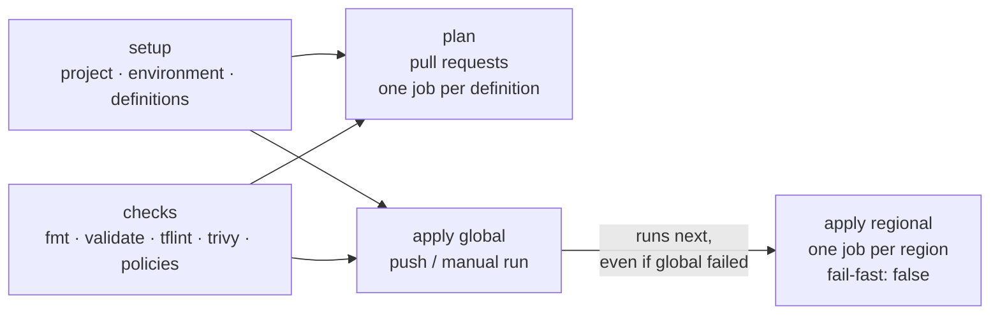

# infrastructure-workflows

The one pipeline every infrastructure repository calls: check, plan, review, apply. It lives here once, as a reusable workflow, and it's versioned like a module: semantic release, a changelog and version tags. Each infrastructure repository holds a few lines that call it at a pinned version.

The module repositories (`terraform-aws-<name>`) get the same treatment from a second reusable workflow, [`module.yml`](#modules-moduleyml): checks on every pull request, and a semantic release of the module on every merge to `main`.

```
infrastructure-workflows/
├── .github/
│   ├── workflows/
│   │   ├── terraform.yml          # the reusable pipeline of the infrastructure repositories
│   │   ├── module.yml             # the reusable pipeline of the module repositories (from v3.3.0)
│   │   ├── release.yml            # semantic-release of this repository, on main
│   │   └── ci.yml                 # checks for this repository itself
│   ├── actions/
│   │   ├── resolve/               # the setup job: project, environment, definitions
│   │   │   ├── action.yml
│   │   │   └── resolve.py
│   │   ├── static-checks/         # everything that runs before a plan
│   │   │   ├── action.yml
│   │   │   ├── install.sh         # pinned tflint, trivy, conftest (and actionlint), checksums verified
│   │   │   ├── run.sh             # the checks themselves; runs locally too
│   │   │   ├── .tflint.hcl
│   │   │   ├── trivy.yaml
│   │   │   └── policy/            # conftest policies (Rego v1) and their unit tests
│   │   ├── module-checks/         # the checks of a module; reuses ../static-checks
│   │   │   ├── action.yml
│   │   │   └── run.sh
│   │   └── module-access/         # read-only token for the private module repositories
│   │       └── action.yml
│   └── actionlint.yaml
├── scripts/bump-internal-refs.sh  # run by the release, see "Versioning and release"
├── tests/                         # resolver unit tests, a conforming fixture project and module
├── .releaserc.json
└── CHANGELOG.md
```

## Calling it

Every repository has this file, and only this file, under `.github/workflows/`:

```yaml
# infrastructure-aws-network/.github/workflows/terraform.yml
name: terraform
on:
  pull_request:
  push:
    branches: [development, main]
  workflow_dispatch:
    inputs:
      region:
        description: Run a single region
        required: false

jobs:
  terraform:
    uses: killers-technology/infrastructure-workflows/.github/workflows/terraform.yml@v3.2.0
    permissions:
      id-token: write
      contents: read
      pull-requests: write
```

The job has to be called `terraform`: the required status check is `terraform / checks` (see [infrastructure-github](../infrastructure-github)). A few repositories differ slightly:

| Repository | Difference |
|---|---|
| `infrastructure-aws-workload` | `push.branches: [development, "release/**", main]`: creating a release branch applies to staging |
| `infrastructure-aws-management` | `with: { plan-role: platform-pipeline-plan, apply-role: platform-pipeline }`: it runs as the roles it creates in every account; and `MODULES_APP_PRIVATE_KEY` (below) |
| `infrastructure-aws-network` | `MODULES_APP_PRIVATE_KEY` (below): it uses the vpc and ipam modules |
| `infrastructure-github` | `secrets: { GH_APP_PRIVATE_KEY: ... }`: its provider signs in as a GitHub App |

### Inputs

| Input | Type | Default | What it does |
|---|---|---|---|
| `terraform-version` | string | `1.16.4` | Terraform version, for the checks, plans and applies |
| `plan-role` | string | `github-<project>-plan` | Role name assumed on pull requests, in the account of each definition |
| `apply-role` | string | `github-<project>-apply` | Role name assumed after a merge |
| `plan-role-duration-seconds` | number | `3600` | Session length plan jobs ask for |
| `role-duration-seconds` | number | `14400` | Session length apply jobs ask for. Both this and the role's maximum session duration default to one hour in AWS; an apply that outlives its credentials leaves a lock and a state that doesn't match reality, so both are raised to cover the slowest apply |

| Secret | Required | What it does |
|---|---|---|
| `GH_APP_PRIVATE_KEY` | no | Only for a skeleton that manages GitHub. Exported as `TF_VAR_github_app_pem_file`, with `TF_VAR_github_app_id` and `TF_VAR_github_app_installation_id` from the `GH_APP_ID` and `GH_APP_INSTALLATION_ID` variables. In apply jobs, a secret or variable of the same name on the GitHub environment wins |
| `MODULES_APP_PRIVATE_KEY` | no | For a skeleton that uses the private module repositories. See [Private module repositories](#private-module-repositories) |

The `region` input of a manual run isn't a `workflow_call` input: the called workflow reads the caller's `workflow_dispatch` input from the event, so the caller stays as short as above.

### Private module repositories

The modules are private repositories (`terraform-aws-vpc`, `terraform-aws-ipam`, `terraform-aws-pipeline-role`, `terraform-aws-state-backend`), consumed by tag:

```hcl
source = "git::https://github.com/killers-technology/terraform-aws-vpc.git?ref=v1.0.0"
```

The workflow token of a job can only read its own repository, so `terraform init` needs another credential to fetch them. That's the **modules-reader** GitHub App: installed on the `terraform-aws-*` repositories only, with Contents: read and nothing else. A caller that uses private modules passes its key:

```yaml
jobs:
  terraform:
    uses: killers-technology/infrastructure-workflows/.github/workflows/terraform.yml@v3.2.0
    permissions:
      id-token: write
      contents: read
      pull-requests: write
    secrets:
      MODULES_APP_PRIVATE_KEY: ${{ secrets.MODULES_APP_PRIVATE_KEY }}
```

Today that's `infrastructure-aws-network` (vpc, ipam) and `infrastructure-aws-management` (pipeline-role, state-backend; its caller also keeps its `with:` role names). The app's client ID is the `MODULES_APP_CLIENT_ID` variable, and the key the `MODULES_APP_PRIVATE_KEY` secret, both at organization level, visible to the repositories that need them.

Every job that runs `terraform init` (checks, plan, apply) then starts with the [module-access](.github/actions/module-access) action. Right after the checkout, it mints a read-only installation token, valid for an hour and revoked when the job ends, and points git at it for that job only (`url.https://x-access-token:<token>@github.com/killers-technology/.insteadOf https://github.com/killers-technology/`). When the caller passes no key, or the variable isn't set, it does nothing, and only public sources can be fetched.

## What a run does



### setup: the pipeline contract

[`resolve.py`](.github/actions/resolve/resolve.py) implements the contract in [docs/conventions.md](../docs/conventions.md):

- **Project**: from the repository name, `infrastructure-aws-<project>` or `infrastructure-<project>`. `infrastructure-github` is project `github`.
- **Kind of repository**: from the folders under `definitions/`. `development` or `staging` means a workload repository; `non-prod` means a platform repository; otherwise it has a single environment, `prod`.
- **Mode and environment**: pull requests plan, pushes and manual runs apply. The environment comes from the branch the pull request targets, or the branch that was pushed:

  | Branch | Workload | Platform | Single environment |
  |---|---|---|---|
  | PR into `development` | plan `development` | plan `non-prod` | plan `prod` |
  | push to `development` | apply `development` | apply `non-prod` | nothing |
  | PR into `release/*` | plan `staging` | nothing | nothing |
  | push to `release/*` | apply `staging` | nothing | nothing |
  | PR into `main` | plan `prod` | plan `prod` | plan `prod` |
  | push to `main` | apply `prod` | apply `prod` | apply `prod` |
  | manual run | as a push to that branch | as a push | as a push |

  Anything else (a pull request into a feature branch, a tag) runs the static checks only.
- **Definitions**: every folder under `definitions/<env>/` with a `backend.hcl`, at any depth. A `global` segment in its path makes it global (`prod/global`, or `prod/network-prod/global` in management, which has one folder per account); the rest are regional (`prod/us-west-2`, `prod/management/us-west-2`).
- **Account and region**: `account_id` and `region` from the definition's `terraform.tfvars`. A missing or malformed `account_id`, a region other than `us-east-1` or `us-west-2`, a global definition outside `us-east-1`, or a folder that disagrees with its own `region` fails the run.
- **Role**: `arn:aws:iam::<account_id>:role/<plan-role|apply-role>`.
- **Manual runs**: the `region` input keeps the regional definitions of that region and drops everything else, global included. `global` keeps only the global definitions. Empty runs everything.

### checks

The [static-checks action](.github/actions/static-checks), in the order the article lists them. Every check runs even if an earlier one failed, so a push shows every problem at once. Lint and security scan run once per definition, with its `terraform.tfvars`: the skeleton is checked the way each definition will run it, so resources that only a global or only a regional definition creates are checked too.

| Check | Tool | Configuration |
|---|---|---|
| Format | `terraform fmt -check -recursive` on `terraform/` and `definitions/` | |
| Validate | `terraform init -backend=false` and `terraform validate` | |
| Lint | tflint 0.64.0, Terraform `recommended` preset and the AWS ruleset 0.49.0 | [`.tflint.hcl`](.github/actions/static-checks/.tflint.hcl) |
| Security scan | trivy 0.74.0, HIGH and CRITICAL fail | [`trivy.yaml`](.github/actions/static-checks/trivy.yaml) |
| Policies | conftest 0.70.1, `--parser hcl2 --combine` | [`policy/`](.github/actions/static-checks/policy) |

The policies, for the organization's own rules:

| Policy | Rule |
|---|---|
| [`providers.rego`](.github/actions/static-checks/policy/providers.rego) | every `provider "aws"` sets `region = var.region`, aliases included (one region per run, nothing hardcoded); every one tags with `Project`, `Environment` and `ManagedBy` through `default_tags`, written in the block or in a `local` of the skeleton |
| [`resources.rego`](.github/actions/static-checks/policy/resources.rego), [`regions.rego`](.github/actions/static-checks/policy/regions.rego) | no `aws_*` resource or data source sets its own `region` (provider v6 allows it; we don't) |
| [`backend.rego`](.github/actions/static-checks/policy/backend.rego) | exactly one backend, `backend "s3" {}`, empty: the definition's `backend.hcl` completes it |
| [`tfvars.rego`](.github/actions/static-checks/policy/tfvars.rego) | every `terraform.tfvars` sets `region` to `us-east-1` or `us-west-2`, and `account_id` to a quoted 12-digit ID |

A deliberate exception is written next to the code, with its reason, where the reviewer sees it: `#trivy:ignore:AWS-0089 <reason>` or `# tflint-ignore: <rule>`. The organization's policies have no inline exceptions; changing one is a release of this repository.

Run the same checks locally, with `terraform`, `tflint`, `trivy` and `conftest` on the `PATH` (validation leaves a `terraform/.terraform` folder behind):

```bash
infrastructure-workflows/.github/actions/static-checks/run.sh infrastructure-aws-network
```

### plan (pull requests)

One job per definition, all in parallel, after the checks pass. Each job assumes the plan role of the definition's account (one hour), runs from the repository root:

```bash
terraform -chdir=terraform init -backend-config=../definitions/<path>/backend.hcl
terraform -chdir=terraform plan -var-file=../definitions/<path>/terraform.tfvars
```

and posts the plan on the pull request: one comment per definition, updated in place on every push.

### apply (push, manual run)

Global definitions first, then one job per regional definition, in parallel. Every apply job:

- runs in the GitHub environment (`development`, `staging`, `non-prod` or `prod`). GitHub only starts it from that environment's branch, after its approval, and only then issues a token whose subject, `repo:killers-technology/<repo>:environment:<env>`, the apply role trusts;
- logs straight into the definition's account, through the STS endpoint of the definition's own region (global definitions: `us-east-1`), and refuses credentials for any other account;
- has `fail-fast: false`, so one failing region never cancels another; the regional jobs start even if a global job failed;
- is never cancelled by a newer run (`concurrency` per environment and definition, `cancel-in-progress: false`): an apply cut in half leaves a lock behind.

When a project has global definitions, prod asks for its approval twice: once when the global jobs start and once when the regional ones do. GitHub asks every job that runs in a protected environment, at the moment it's about to start.

### What Terraform gets

| Variable | Value |
|---|---|
| `TF_VAR_pipeline_role` | `plan` or `apply` |
| `TF_VAR_web_identity_token_file` | a GitHub OIDC token for `sts.amazonaws.com`, for providers that log into a second account themselves (network's prod definitions, which publish the IPAM pool IDs into both Shared Services accounts) |
| `TF_VAR_github_app_*` | GitHub App credentials, for infrastructure-github |
| `AWS_STS_REGIONAL_ENDPOINTS` | `regional` |
| `TF_IN_AUTOMATION`, `TF_INPUT` | `true`, `false` |

All of them are exported to every Terraform run; Terraform ignores `TF_VAR_` variables a skeleton doesn't declare. The OIDC token is fetched right before `plan` or `apply` because it's only valid for a few minutes. It can't be refreshed, so a provider that logs in with it must ask for a session (`assume_role_with_web_identity { duration }`) that covers the whole run.

## Modules: module.yml

Available from v3.3.0. Every module repository holds one short caller:

```yaml
# terraform-aws-vpc/.github/workflows/module.yml
name: module
on:
  pull_request:
  push:
    branches: [main]

jobs:
  module:
    uses: killers-technology/infrastructure-workflows/.github/workflows/module.yml@v3.3.0
    permissions:
      contents: read
```

The job has to be called `module`: the required status check is `module / checks`.

| Input | Type | Default | What it does |
|---|---|---|---|
| `terraform-version` | string | `1.16.4` | Terraform version for the checks and the tests |

| Secret | Required | What it does |
|---|---|---|
| `MODULES_APP_PRIVATE_KEY` | no | Only for a module that calls another private module. Same mechanism as above |
| `RELEASE_APP_PRIVATE_KEY` | no | Never passed: it's a secret of the module repository's `release` environment, which takes precedence in the release job |

**checks** (every pull request and push): the [module-checks](.github/actions/module-checks) action. It reuses the tools, the pinned versions and the configuration of the static checks (`../static-checks/install.sh`, `.tflint.hcl`, `trivy.yaml`, `policy/`). That works from a remote reference too: GitHub downloads the whole repository at the referenced tag, so the sibling folder is always the same version.

| Check | What |
|---|---|
| Format | `terraform fmt -check -recursive` |
| Validate | `terraform init -backend=false` and `terraform validate`. A module that takes a second provider through `configuration_aliases` (terraform-aws-ipam) can't be validated on its own, so validation declares those aliases, empty, in a temporary file |
| Lint | tflint, same configuration as the projects |
| Security scan | trivy, same configuration |
| Policies | [`module.rego`](.github/actions/static-checks/policy/module.rego): no provider blocks (the caller passes its providers in), no backend, and no `aws_*` resource or data source with its own `region` |
| Tests | `terraform test`, if the module has `*.tftest.hcl` files. The job has no cloud credentials, so tests use mock providers |

Locally: `infrastructure-workflows/.github/actions/module-checks/run.sh terraform-aws-vpc` (also needs `jq`).

**release** (push to `main`, after the checks pass): semantic-release, configured by the module's own `.releaserc.json`, as the release GitHub App in the module's `release` environment, exactly as this repository releases itself. Conventional commits make the version, the changelog is committed back, and the tag is `vX.Y.Z`. Consumers pin it with `?ref=vX.Y.Z`, and a new module version is tried in one consumer before the others move to it.

## Versioning and release

Every merge to `main` is a candidate release. [semantic-release](.releaserc.json) reads the conventional commits since the last tag: `fix:` makes a patch, `feat:` a minor, `BREAKING CHANGE:` a major. It writes the new section of [CHANGELOG.md](CHANGELOG.md), commits it, tags `vX.Y.Z` and publishes the GitHub release. Callers always pin a full version, never `@v3` or `@main`.

**Internal refs.** The reusable workflows use this repository's own actions with a full reference:

```yaml
uses: killers-technology/infrastructure-workflows/.github/actions/static-checks@v3.2.0
```

It can't use `./.github/actions/...`: in a called workflow, a relative path points into the caller's checkout, not into this repository. So the release bumps those refs itself. In its prepare step, semantic-release runs [`scripts/bump-internal-refs.sh`](scripts/bump-internal-refs.sh) with the new version, which rewrites every `killers-technology/infrastructure-workflows/.github/actions/<name>@v...` in `terraform.yml` and `module.yml` to `@v<new version>` and fails if one is missed. `@semantic-release/git` commits the result together with the changelog (`chore(release): vX.Y.Z [skip ci]`), and the tag points at that commit. So tag `vX.Y.Z` only ever runs actions from `vX.Y.Z`.

Two consequences:

- Between releases, the reusable workflows on `main` point at the actions of a release, not of the commit. CI therefore tests the actions from the pull request's own commit: the static-checks action against [a conforming fixture project](tests/fixtures/infrastructure-aws-example), the module-checks action against [a conforming fixture module](tests/fixtures/terraform-aws-example) with its tests, the resolver with [unit tests](tests/test_resolve.py), the policies with `conftest verify`.
- On `main` today, `terraform.yml` points at `@v3.2.0`, the version every infrastructure repository pins, and `module.yml`, which isn't part of any release yet, at `@v3.3.0`, the release that will ship it. The release rewrites both to the same version.
- The release pushes to `main`, which is otherwise only reachable through a pull request. It runs as a dedicated release GitHub App, the only bypass actor on this repository's `main`, and the only actor allowed to create `v*` tags, which nobody can move or delete. Its key is a secret of the `release` environment, which only accepts `main`. Those settings are in [infrastructure-github](../infrastructure-github).

| Setting | Where | Value |
|---|---|---|
| `RELEASE_APP_CLIENT_ID` | variable of the `release` environment | the release app's client ID |
| `RELEASE_APP_PRIVATE_KEY` | secret of the `release` environment | the release app's private key |

## Rolling out a new version

A new version is tried on a non-critical repository before the rest move to it.

1. Merge the change; the release publishes `vX.Y.Z` and its changelog.
2. Bump the canary first. Here that's `infrastructure-aws-workload` through its normal flow: the bump's pull request into `development` plans with the new version, and the merge applies the development account only. Nothing else has moved.
3. Let it run a full cycle: pull request plans, applies, and a manual single-region run if the change touches the apply path.
4. Then bump the other repositories, one pull request each (a Renovate or Dependabot rule can open them). The canary's version reaches staging and prod with its next release, through the same approvals as any other change.
5. If the canary fails, it pins back to the previous tag, and the fix is a new patch release. Tags never move.

**v3.3.0 is the example.** It's the first release with `module.yml`, the module checks and the module rules of the policies. The module repositories are its canary: they're the first callers of `@v3.3.0`, and nothing deploys from them, so a broken pipeline delays a module release and nothing else. The infrastructure repositories stay on `@v3.2.0`, which already has everything they use, private module access included, and move to v3.3.0 only once it has run through a few module pull requests and releases.

## Checks for this repository

[`ci.yml`](.github/workflows/ci.yml) runs on every pull request; its job names are the required status checks on `main`:

| Job | What |
|---|---|
| `actionlint` | lints every workflow, including the `run:` scripts through shellcheck |
| `policies` | `conftest verify` (policy unit tests) and `conftest fmt --check` |
| `resolver` | `python3 -m unittest` for the resolver, shellcheck for the scripts |
| `static-checks` | runs the static-checks action from this commit against the fixture project |
| `module-checks` | runs the module-checks action from this commit against the fixture module, tests included |
